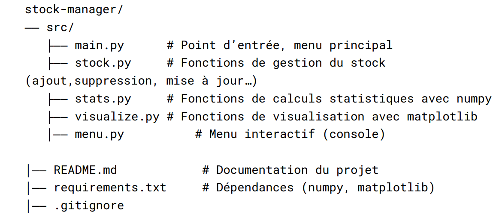

# Gestion de stock de fournitures scolaires 

## 1-Présentation du projet :

*Ce projet est une application en console permettant de __gérer un stock__  de produits de manière simple et efficace. Elle permet à l'utilisateur d'__ajouter__, ___supprimer__, __modifier__ des produits, tout en fournissant des statistiques utiles et des __visualisations graphiques__ pour mieux comprendre la répartition et la valeur du stock. Le projet repose sur __Python__, en utilisant les __bibliothèques NumPy__ pour les calculs et Matplotlib pour les graphiques.*

## 2-Fonctionnalités principales :

### 2-1-Gestion du stock :

#### ✅ *Ajouter un produit;*
#### ✅ *Supprimer un produit;*
#### ✅ *modification des produits (nom, quantité, prix);*
#### ✅ *Affichage du stock actuel.*

### 🖥️ 2-2-Installation: 
*Étapes pour installer et exécuter le projet :*

#### *- Installation :*
#### 1. Cloner le dépôt;
#### 2. Installer les dépendances;
#### 3. Lancer le script principal
###  2-3-Technologies utilisées :
#### *- Technologies :*
#### *- Python 3.11*
#### *- Matplotlib*
### 2-4-Structure des fichiers :

## *Structure du projet*

### 2-5-Statistiques :

#### *Calcul de la valeur totale du stock.*
 
#### *Prix moyen, minimum, maximum.*

#### *Identification du produit le plus cher et du moins cher.*

### 2-6-Visualisations :

#### *- Diagramme en barres : quantité par produit;*

#### *- Diagramme circulaire : part de chaque produit dans la valeur totale du stock.*

### 2-7-Interface console :

 *Menu interactif pour accéder facilement à toutes les fonctionnalités.
 L'application fonctionne via une interface console (texte), à travers un menu interactif proposé à l'utilisateur dans le fichier `main.py`.

Voici les options disponibles :

*1- Ajouter un produit;

2- Supprimer un produit;

3- Modifier la quantité d’un produit;

4-Afficher le stock;

5-Afficher les statistiques;

6-Afficher un graphique de barres ;
7-Afficher un graphique de pie ;
8-Quitter.*

### 2-8- Sructure du projet :
*Fatima MACHAY_ Karima_Ben_Ihda.*

### 2-9- Sructure du projet :

